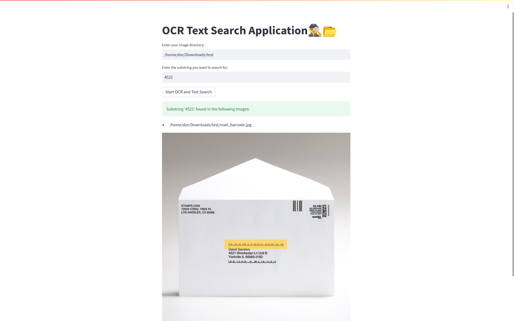

---

# OCR and Text Search Application




This application allows users to perform Optical Character Recognition (OCR) and text search in images within a specified directory. The application rotates each image by 0, 90, 180, and 270 degrees and performs OCR on each rotated image. It then searches for a specified substring within the recognized text and returns the names of images where the substring is found.

## Prerequisites

Before you begin, ensure you have installed the following:

- Python 3.7+
- Streamlit
- pytesseract
- Pillow

Also, make sure Tesseract is properly installed on your system, and its path is added to the system's path variable.

## Installation

1. Clone the repository to your local machine:

```
git clone https://github.com/DorGetter/ImageTextFinder.git
```

2. Navigate to the project directory:

```
cd ImageTextFinder
```

3. Install the necessary Python packages by running the following command:

```
pip install -r requirements.txt
```

This will install all the necessary dependencies as listed in the `requirements.txt` file, which includes `streamlit`, `pytesseract`, and `Pillow`.

## Usage

To start the application, run the Python script using Streamlit:

```
streamlit run image_text_finder.py
```

This will open a new browser window where you can interact with the application.

Within the application:

- Enter the path of your image directory in the text input field labeled "Enter your image directory:"
- Enter the substring you want to search for in the text input field labeled "Enter the substring you want to search for:"
- Click the "Start OCR and Text Search" button to start the OCR and text search process

The application will display a success message if the substring is found in any image, and a warning message if the substring is not found. If any errors occur during the process, an error message will be displayed.

## License

This project is licensed under the terms of the MIT license.

---

Please replace `main.py` with the name of your Python script, `https://github.com/your-github-username/your-repo-name.git` with the URL of your GitHub repository, `your-repo-name` with the name of your directory, and update the prerequisites, installation instructions, and license as necessary.
